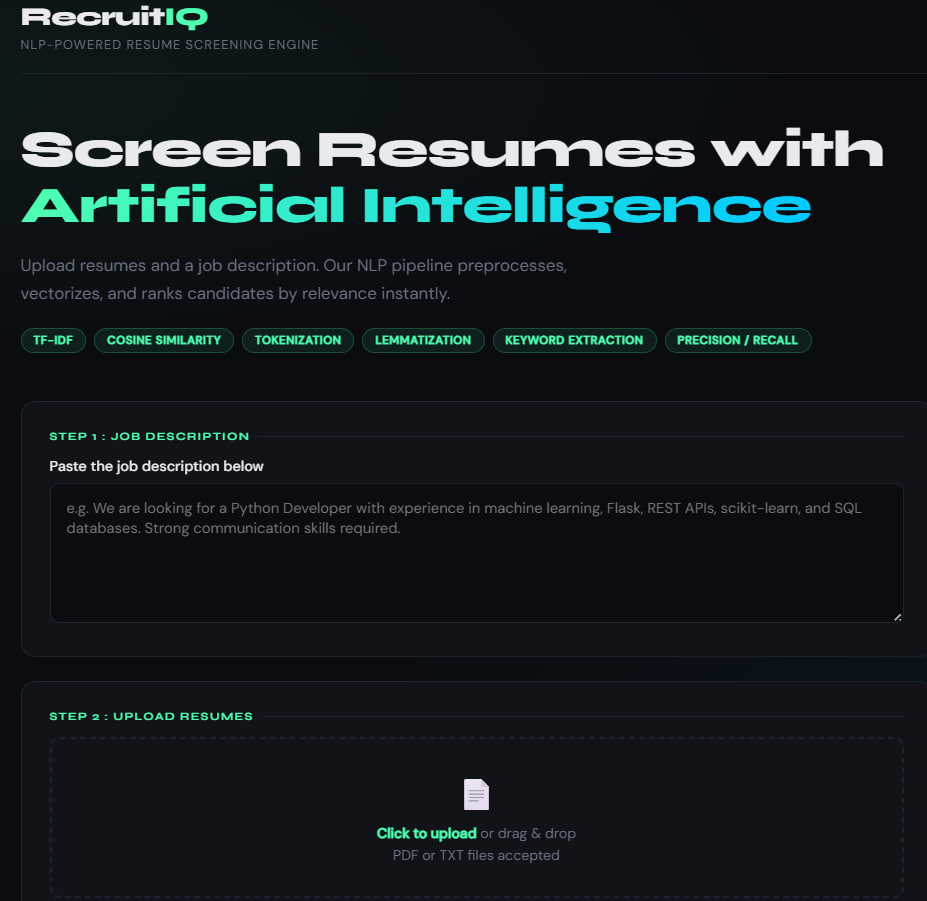
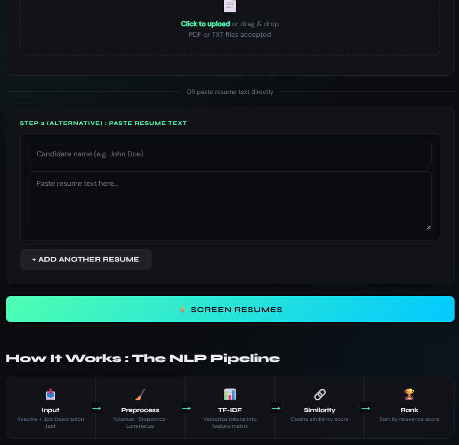
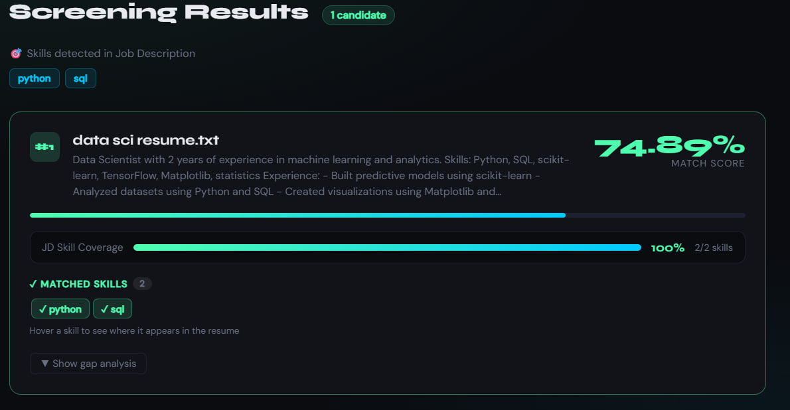
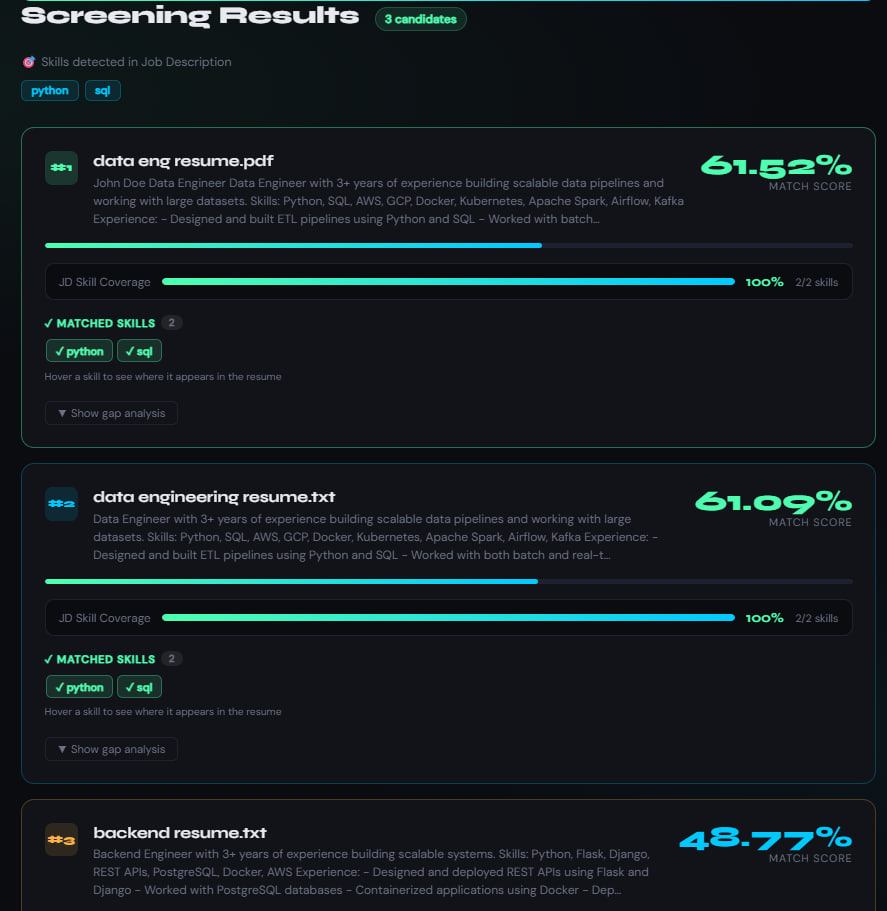

# RecruitIQ, an AI powered resume screening engine

Screens rank, and analyzes resumes against a job description using Natural Language Processing (NLP), TF-IDF, Semantic embeddings, and cosine similarity.
Input:
<p align="center">
  
  
</p>

Output single resume analysis or comparision of multiple resumes.
<p align="center">
  
</p>
<p align="center">
  
</p>
## Overview

RecruitIQ is an intelligent resume screening platform designed to help recruiters quickly identify the most relevant candidates for a job opening.

Instead of manually reviewing dozens of resumes, RecruitIQ uses NLP techniques to:

- Extract skills from job descriptions

- Analyze uploaded resumes

- Calculate relevance scores

- Rank candidates automatically

- Highlight matched and missing skills

- Provide resume improvement suggestions

The system combines traditional information retrieval techniques with modern semantic AI models for more accurate candidate matching.

## Features

**1. Multiple Resume Input Methods**
- Upload multiple PDF resumes
- Upload TXT resumes
- Paste resume text directly into the interface
- Add multiple candidates manually

**2. Intelligent Job Description Analysis**
- Detects technical skills automatically
- Extracts keywords from job descriptions
- Creates skill matching criteria

**3. AI-Powered Resume Ranking**

Uses a hybrid scoring approach:

| Technique             | Purpose                |
| --------------------- | ---------------------- |
| TF-IDF                | Keyword relevance      |
| Cosine Similarity     | Document similarity    |
| Sentence Transformers | Semantic understanding |
| Skill Coverage        | Direct skill matching  |

**4. Candidate Comparison**

For every candidate:

- Match score
- Candidate rank
- JD skill coverage
- Matched skills
- Missing skills

**5. Gap Analysis**

RecruitIQ identifies:

- Skills missing from resumes
- Extra skills not mentioned in JD
- Areas where candidates can improve

## Scoring Methodology

It uses a **weighted hybrid scoring model.**

Final Score =
(0.4 × TF-IDF Similarity)
+
(0.3 × Semantic Similarity)
+
(0.3 × Skill Coverage)

**Components**
**TF-IDF Similarity (40%)**

Measures keyword overlap between the resume and job description.

**Semantic Similarity (30%)**

Uses SentenceTransformer embeddings to understand contextual meaning.

**Skill Coverage (30%)**

Calculates how many required job skills appear in the resume.

## Technologies Used

**Backend**
- Python
- Flask
- Scikit-Learn
- Sentence Transformers
- PyPDF2

**NLP & Machine Learning**
- TF-IDF Vectorization
- Cosine Similarity
- MiniLM-L6-v2 Embeddings
- Skill Extraction
- Semantic Matching

## Installation

1. Clone Repository
```
git clone https://github.com/pavit15/RecruitIQ.git
cd RecruitIQ
```
2. Create Virtual Environment
```
python -m venv venv
```
Windows
```
venv\Scripts\activate
```
Linux / Mac
```
source venv/bin/activate
```
3. Install Dependencies
```
pip install -r requirements.txt
```
4. Run Application
```
python app.py
```
5. Open Browser
```
http://127.0.0.1:5000
```


